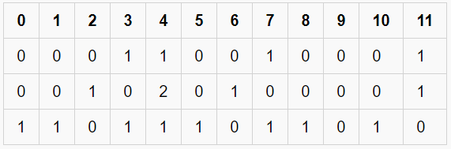
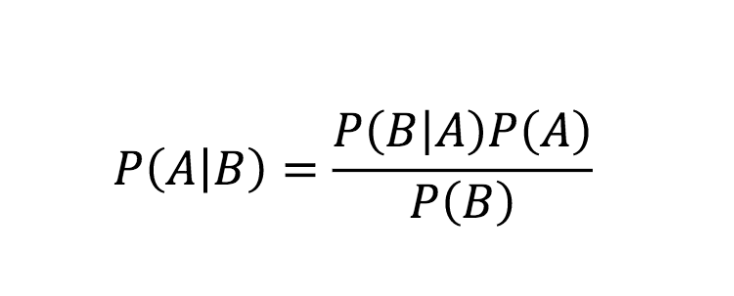

-----------
### Wow this note book thing is cool

##### what am i doing <br>

- who knows
- all fee sabeel illah inshallah


--------


# *Supervised Machine Learning*


- Supervised learning refers to the method of ML that gives a neural model a data set and key, and from that <br>
- It begins to make classifying predictions on novel data.


```python
import pandas as pd
import numpy as np 
from sklearn.feature_extraction.text import CountVectorizer
from sklearn.model_selection import train_test_split
from sklearn.naive_bayes import BernoulliNB
```

----
<br>

#### Lets see what data we're working with here


```python
data = pd.read_json("sarcastable.json", lines=True)
print(data.head())
```

                                            article_link  \
    0  https://www.huffingtonpost.com/entry/versace-b...   
    1  https://www.huffingtonpost.com/entry/roseanne-...   
    2  https://local.theonion.com/mom-starting-to-fea...   
    3  https://politics.theonion.com/boehner-just-wan...   
    4  https://www.huffingtonpost.com/entry/jk-rowlin...   
    
                                                headline  is_sarcastic  
    0  former versace store clerk sues over secret 'b...             0  
    1  the 'roseanne' revival catches up to our thorn...             0  
    2  mom starting to fear son's web series closest ...             1  
    3  boehner just wants wife to listen, not come up...             1  
    4  j.k. rowling wishes snape happy birthday in th...             0  
    


```python
data["is_sarcastic"] = data["is_sarcastic"].map({0:"Not_Sarcasm", 1:"Sarcasm"})
```

- This is a data set that classifies article headlines as either sarcastic or not
- from this data set, we will train a neural model to classify any text as either sarcasm or not.
<br>
----
#### The data has now been classified, mapped to new values that are more readable.

 example below ⬇️
 


```python
print(data.head())
```

                                            article_link  \
    0  https://www.huffingtonpost.com/entry/versace-b...   
    1  https://www.huffingtonpost.com/entry/roseanne-...   
    2  https://local.theonion.com/mom-starting-to-fea...   
    3  https://politics.theonion.com/boehner-just-wan...   
    4  https://www.huffingtonpost.com/entry/jk-rowlin...   
    
                                                headline is_sarcastic  
    0  former versace store clerk sues over secret 'b...  Not_Sarcasm  
    1  the 'roseanne' revival catches up to our thorn...  Not_Sarcasm  
    2  mom starting to fear son's web series closest ...      Sarcasm  
    3  boehner just wants wife to listen, not come up...      Sarcasm  
    4  j.k. rowling wishes snape happy birthday in th...  Not_Sarcasm  
    

-----
Now we reduce the data set to what we need, remove the link and such. 


```python
data = data[["headline", "is_sarcastic"]]
```

Now to set up the arrays using numpy ⏬


```python
#headlines as x and sarcasm as y? is this necessary or haphazard
#its essentially haphazard, but helps with understanding
#no it is not haphazard. train_test_split syntax implies that training data is X and feedback is y

x = np.array(data["headline"])
y = np.array(data["is_sarcastic"])
```

### Count Vectorizer 

- This tool from sklearn allows for the indexing of unique words from some text, and from this indexing,<br>
 a matrix of frequency for each word is formed. 
 
 For example: ⬇️<br><br>


  <br>

- Each number on row[0] represents a unique word <br>

- Each subsequent row represents a line of text, each words frequency encoded in the columns

 


```python
cv = CountVectorizer()
X = cv.fit_transform(x)
```

----
- Now, we split the data into training and test constituents
- the 0.2 represents a split of 20% testing data and 80% training
- ((The test should then spit out a result regarding accuracy of the model))
  


```python
X_train, X_test, y_train, y_test = train_test_split(X,y,test_size=0.2,random_state=42)   

```

----
- Now we instantiate a Bernoulli Naive Bayes model, a neural model built on the Bayes' Theorem, shown below 🔽 <br>
  
  

- This model exceeds at classifying binaries


```python
model = BernoulliNB()
model.fit(X_train, y_train)
print("Model Accuracy: ")
print(model.score(X_test,y_test))
```

    Model Accuracy: 
    0.8448146761512542
    

Success!<br>
Now, we can try user input and classify it as sarcasm or otherwise<br>
- - - - - - - -
--say we input: *"Cats planning to donate extra lives to local childrens hospital "*


```python
user = input("Speak: ")
data = cv.transform([user])
out = model.predict(data)
print(out)

```

    ['Sarcasm']
    

--and now if we input: *"There is an orange farm creating juice for locals"*


```python
user = input("Speak: ")
data = cv.transform([user])
out = model.predict(data)
print(out)

```

    ['Not_Sarcasm']
    
```ad-example
example
```
    
